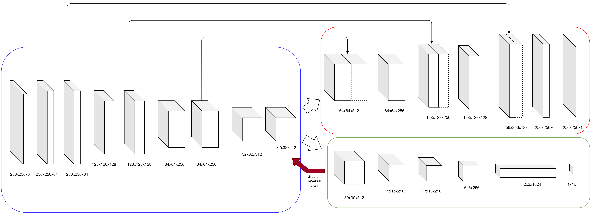

# Unsupervised Domain Adaptation For Plant Organ Counting (UDA4POC)

This repository contains codes written for a paper we published on CVPPP 2020 and an opensource Wheat Spikelet Dataset in an infield setting. 

Paper: 

we used a Domain-Adversarial Neural Network (DANN)[[1]](#1). We customized the network proposed in [[1]](#1) by replacing the main classification network
with a U-Net network that is used for density map estimation

Our model is fully implemented using the Pytorch framework. The model was trained with a batch size of 8. The input images in the training set
were resized to 256×256 pixels. 

### Wheat Spikelet Dataset

The annotated dataset in this repository is based on Global Wheat Dataset (GWD) [[2]](#2). GWD is a dataset presented in the Kaggle wheat head detection competition. The dataset comes with bounding box annotations for each wheat head. We took 67 images from the GWD dataset and made dot annotations for spikelets. To use these dataset, cite the following works

@misc{david2020global,
  title={Global Wheat Head Detection (GWHD) dataset: a large and diverse dataset of high resolution RGB labelled images to develop and benchmark wheat head detection methods},
  author={David, Etienne and Madec, Simon and Sadeghi-Tehran, Pouria and Aasen, Helge and Zheng, Bangyou and Liu, Shouyang and Kirchgessner, Norbert and Ishikawa, Goro and Nagasawa, Koichi and Badhon, Minhajul Arifin and others},
  journal={arXiv preprint arXiv:2005.02162},
  year={2020}
}

## References

<a id="1">[1]</a> 
Domain-Adversarial Training of Neural Networks
http://jmlr.org/papers/volume17/15-239/15-239.pdf

<a id="2">[2]</a> 
Global Wheat Head Detection (GWHD) dataset: a large and diverse dataset of high resolution RGB labelled images to develop and benchmark wheat head detection methods
https://arxiv.org/abs/2005.02162