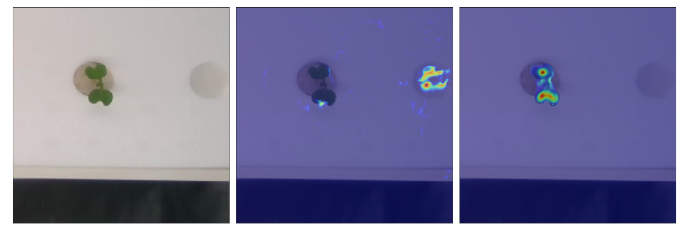

# Unsupervised Domain Adaptation For Plant Organ Counting (UDA4POC)

This repository contains codes written for a paper we published on ECCV 2020 Workshop on COMPUTER VISION PROBLEMS IN PLANT PHENOTYPING (CVPPP 2020). Additionally, the repository contains an opensource outdoor Wheat Spikelet annotation dataset.

Paper: 

We used a Domain-Adversarial Neural Network (DANN)[[1]](#1). We customized the network proposed in [[1]](#1) by replacing the main classification network
with a U-Net network that is used for density map estimation

*The proposed Domain-Adversarial Neural Network composed of two networks that share weights between Conv1 and Conv8. The downsampling subnetwork, the upsampling subnetwork, and the domain classifier are denoted by the blue, red, and green boxes respectively. The red arrow shows the Gradient Reversal Layer*

## Training
Our model is fully implemented using the Pytorch framework. The model was trained with a batch size of 8. The input images in the training set were resized to _256×256_ pixels. In the repositiory we've included weights stored from our experiments presented in our paper.

### Sample training 
Here, we show our Domain adapation in leaf counting experiment where CVPPP 2017 LCC Dataset is used as a source domain and KOMATSUNA Dataset is a target domain. We use the leaf center annotations from the source domain and generated the groudtruth density map by filtering the center points with a 2D gaussian filter with σ = 3.

*Example images for leaf counting experiments: (Top) Source dataset: Arabidopsis, CVPPP Dataset, (Bottom) Target dataset: KOMATSUNA Dataset*

For this experiment, we randomly selected 80% of the images from the CVPPP dataset and merged them with the images from the KOMATSUNA dataset. The remaining 20% of the source domain is used for validation. With this setting, we trained our model for 150 epochs. The figure below shows the prediction of our model vs a vanilla U-Net based baseline model.

*Sample density map estimations from the adapted model in the leaf counting task. From left to right: Input image, baseline prediciton, our model's prediction*

## How to use?
To train the UDA4POC model

	python train.py -s <source domain pickle path> -t <target domain pickle path> -e <number of epochs> -o <output weight path> -w <pre-trained weight path>

-s: source domain python pickled dictionary where keys represent source image names, and the value for each key is a list of the _256x256_ image and its corresponding density map.  
-t: target domain python pickled dictionary where keys represent target image names, and the value for each key is a  _256x256_ image  
-e: number of epochs to train the model  
-o: path to save the weight after trianing the model  
-w: (optional parameter) pre-trained weight path

## Citing

#### Wheat Spikelet Dataset

The annotated dataset in this repository is based on Global Wheat Dataset (GWD) [[2]](#2). GWD is a dataset presented in the Kaggle wheat head detection competition. The dataset comes with bounding box annotations for each wheat head. We took 67 images from the GWD dataset and made dot annotations for spikelets. If you used this dataset, please cite the following works

	@article{david2020global,
	  title={Global Wheat Head Detection (GWHD) dataset: a large and diverse dataset of high resolution RGB labelled images to develop and benchmark wheat head detection methods},
	  author={David, Etienne and Madec, Simon and Sadeghi-Tehran, Pouria and Aasen, Helge and Zheng, Bangyou and Liu, Shouyang and Kirchgessner, Norbert and Ishikawa, Goro and Nagasawa, Koichi and Badhon, Minhajul Arifin and others},
	  journal={arXiv preprint arXiv:2005.02162},
	  year={2020}
	}

## References

<a id="1">[1]</a> 
Domain-Adversarial Training of Neural Networks
http://jmlr.org/papers/volume17/15-239/15-239.pdf

<a id="2">[2]</a> 
Global Wheat Head Detection (GWHD) dataset: a large and diverse dataset of high resolution RGB labelled images to develop and benchmark wheat head detection methods
https://arxiv.org/abs/2005.02162